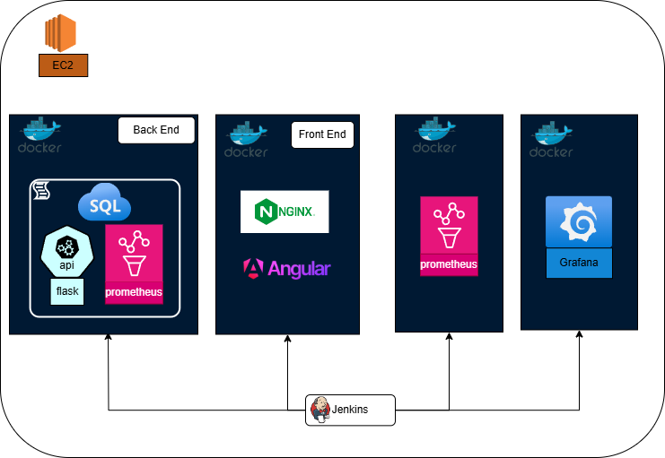

# SLO Monitoring Dashboard

## Table of Contents
1. [Introduction](#introduction)
2. [Application Structure](#application-structure)
3. [Backend API](#backend-api)
4. [Frontend Application](#frontend-application)
5. [CI/CD Pipeline](#ci-cd-pipeline)
6. [Docker Containers](#docker-containers)
7. [Development](#development)
    1. [Backend Code Overview](#backend-code-overview)
    2. [Frontend Code Overview](#frontend-code-overview)
8. [Kubernetes Deployment](#kubernetes-deployment)
9. [Installing Docker and Jenkins on an EC2 Instance](#installing-docker-and-jenkins-on-an-ec2-instance)
10. [Automated Deployment on AWS EC2](#automated-deployment-on-aws-ec2)
11. [Monitoring and Metrics](#monitoring-and-metrics)
12. [Prometheus Metrics](#prometheus-metrics)
13. [Grafana Dashboard](#grafana-dashboard)


## Overview


This project is a complete stack monitoring dashboard application that allows users to monitor stock market performance, news, and personal portfolios. The application is divided into two parts:

- **Backend**: A Flask-based API that provides stock data, news, and portfolio information using `yfinance`, `Alpha Vantage`, and Prometheus for monitoring.
- **Frontend**: An Angular-based dashboard that offers an interface to view the data provided by the backend.

## Features

### Backend
- Stock information retrieval via `yfinance`.
- Stock fundamental data via Alpha Vantage API.
- News and portfolio management using `Flask-SQLAlchemy`.
- Prometheus metrics integration for monitoring system performance.
- User authentication and portfolio tracking.
- Flask CORS support for cross-origin requests.
- Exposes metrics for Prometheus, including custom metrics such as memory usage, CPU usage, and HTTP status codes.

### Frontend
- Built with Angular for a responsive user interface.
- Displays real-time stock data and news.
- Allows users to view and manage their stock portfolios.

## Application Architecture




The application is composed of two major components:
1. **Backend (Flask API)**: Provides APIs for stock data, portfolio management, user login, and news.
2. **Frontend (Angular)**: Displays stock data, market trends, and portfolio information to the user.
   
## CI/CD Architecture
The system is built using Docker, Jenkins, and Kubernetes for scalability and CI/CD.
1. **Docker**: Containerizes the application, managing the backend, frontend, and other services. The `docker-compose.yml` file orchestrates the containers.
2. **Jenkins**: Automates the CI/CD pipeline, building, testing, and deploying the application via Docker.
3. **Kubernetes**: Manages deployment, scaling, and monitoring of containers in production, using the `slo-monitoring-dashboard.yaml` configuration.


### Folder Structure
```
SLO-MONITORING-DASHBOARD/
├── backend/                    # Flask Backend
│   ├── app.py                  # Main Flask app
│   ├── Dockerfile              # Dockerfile for Backend
│   ├── requirements.txt        # Python dependencies
│   └── prometheus.yml          # Prometheus configuration
├── frontend/                   # Angular Frontend
│   ├── src/                    # Angular source code
│   ├── Dockerfile              # Dockerfile for Frontend
│   ├── nginx.conf              # Custom Nginx configuration
│   └── angular.json            # Angular project configuration
├── docker-compose.yml          # Docker Compose configuration for both backend and frontend
├── slo-monitoring-dashboard.yaml  # Kubernetes deployment YAML file
└── README.md                   # Project documentation
```

## Backend Setup

### Prerequisites
- Python 3.9+
- Docker

### Installation

1. Clone the repository:
   ```bash
   git clone https://github.com/yourusername/slo-monitoring-dashboard.git
   cd slo-monitoring-dashboard/backend
   ```

2. Install dependencies:
   ```bash
   pip install -r requirements.txt
   ```

3. Start the application:
   ```bash
   flask run
   ```

4. Access the Prometheus metrics at `http://localhost:5000/metrics`.

### API Endpoints

- `/stock/<ticker>`: Fetch stock data for the given ticker.
- `/top-stocks`: Fetch top stock data.
- `/market-news`: Get the latest market news.
- `/portfolio`: Get the current portfolio of the logged-in user.
- `/buy`: Buy stock for the user.
- `/sell`: Sell stock for the user.


## Frontend Setup

### Prerequisites
- Node.js 18.x+
- Angular CLI

### Installation

# Installing Docker and Jenkins on an EC2 Instance

This guide provides steps to install Docker and Jenkins on an AWS EC2 instance running Ubuntu.

## Prerequisites
1. **AWS EC2 instance**: Make sure your EC2 instance is running and accessible (Ubuntu 20.04 or later is recommended).
2. **SSH Access**: Ensure you can connect to your instance via SSH using the appropriate key pair.

###  Update the EC2 Instance
Before installing any packages, it's a good practice to update the package manager:
```bash
sudo apt update && sudo apt upgrade -y
### Install Docker
## 1- Install required dependencies:
   ```bash
   sudo apt install apt-transport-https ca-certificates curl software-properties-common -y
   ```
## 2- Add Docker’s official GPG key:
   ```bash
   curl -fsSL https://download.docker.com/linux/ubuntu/gpg | sudo apt-key add -
   ```
## 3- Set up the Docker repository:
   ```bash
   sudo add-apt-repository "deb [arch=amd64] https://download.docker.com/linux/ubuntu $(lsb_release -cs) stable"
   ```
## 4- Install prerequisite packages for HTTPS over apt:
   ```bash
  sudo apt install apt-transport-https ca-certificates curl software-properties-common
   ```
## 5- Update your package database again to include Docker packages:
   ```bash
  sudo apt update
   ```
## 6- Verify you're about to install Docker from the official Docker repository:
   ```bash
  apt-cache policy docker-ce
   ```
## 7-Install Docker:
   ```bash
 sudo apt install docker-ce
   ```
## 8-Check that Docker is running:
   ```bash
sudo systemctl status docker
   ```
## 9- (Optional) Avoid using sudo for Docker commands: Add your user to the docker group so you don’t need to use sudo for Docker commands:
   ```bash
sudo usermod -aG docker ${USER}
   ```
### Installing Jenkins on Ubuntu EC2
## 1- Install Java (required for Jenkins):
 ```bash
sudo apt install openjdk-11-jdk
   ```
## 2- Add Jenkins repository key:
 ```bash
curl -fsSL https://pkg.jenkins.io/debian-stable/jenkins.io.key | sudo apt-key add -
   ```
## 3- Append Jenkins repository to your sources list:

 ```bash
echo "deb https://pkg.jenkins.io/debian-stable binary/" | sudo tee -a /etc/apt/sources.list
   ```
## 4- Update your package list:

 ```bash
sudo apt update
   ```
## 5- Install Jenkins:

 ```bash
sudo apt install jenkins
   ```
## 6- Start jenkins
 ```bash
sudo systemctl start jenkins
   ```
## 7- Enable Jenkins to start on boot:
 ```bash
sudo systemctl enable jenkins
   ```
## 8-Check that Jenkins is running:
 ```bash
sudo systemctl status jenkins
   ```
##Configuring Firewall (UFW) to Allow Jenkins Traffic
 ```bash
sudo ufw status
sudo ufw allow 8080
   ```
### Accessing Jenkins
## 1- Open a web browser and navigate to:
http://<your-ec2-ip>:8080
## 2- Find the initial administrator password: Run the following command to get the Jenkins administrator password:
 ```bash
sudo cat /var/lib/jenkins/secrets/initialAdminPassword
   ```
Enter the password into the web interface and follow the setup instructions to install plugins and create an admin user.
## Running with Docker

You can easily run both the frontend and backend with Docker using either Docker Compose or Kubernetes.

### Docker Compose

1. Ensure Docker is installed and running on your system.
2. Run the following command to build and start the containers:
   ```bash
   docker-compose up --build
   su - ${USER}
   ```

3. Access the frontend at `http://localhost:80` and the backend at `http://localhost:8001`.

### Kubernetes

1. Deploy the application using the provided Kubernetes YAML file:
   ```bash
   kubectl apply -f slo-monitoring-dashboard.yaml
   ```

2. Kubernetes will manage the frontend and backend as services. Adjust the `slo-monitoring-dashboard.yaml` file to configure scaling, ingress, and other settings as needed.


## Automated Deployment on AWS EC2 with Jenkins and Docker

This section guides you through setting up an AWS EC2 instance to deploy our application using Jenkins and Docker. It includes steps to configure Jenkins to pull from the GitHub repository and build the application images automatically.

### Prerequisites
- An active AWS account with permissions to manage EC2, IAM, and EC2 Container Service.
- A GitHub account with a repository containing your project.
- Familiarity with basic AWS operations and Docker.

### Setup
1. **AWS EC2 Instance Setup:**
   - Launch an EC2 instance using the Amazon Linux 2 AMI.
   - Ensure the instance has an appropriate security group with ports 80, 443, and 8080 open for web traffic and Jenkins access.
   - Install Docker and Jenkins on the EC2 instance. Detailed instructions can be found at AWS Documentation or Jenkins installation guide.

2. **Configure Jenkins Credentials:**
   - Navigate to the Jenkins Dashboard.
   - Go to `Manage Jenkins` > `Manage Credentials`.
   - Under `(global)`, use the `Add Credentials` button to add your Docker Hub and GitHub credentials. Assign IDs `my-docker-credentials` and `github-token` respectively.

3. **Jenkins Pipeline Configuration:**
   - Create a new item on the Jenkins dashboard by selecting `New Item`, then choose `Pipeline` and name your job.
   - In the Pipeline configuration, paste the following Jenkinsfile script that defines your CI/CD process:
     ```groovy
     pipeline {
         agent any

         environment {
            DOCKER_CREDENTIALS_ID = 'my-docker-credentials'
            GITHUB_CREDENTIALS_ID = 'github-token'
            DOCKER_REGISTRY = 'your-docker-hub-username'
            FRONTEND_IMAGE = "${DOCKER_REGISTRY}/frontend"
            BACKEND_IMAGE = "${DOCKER_REGISTRY}/backend"
         }

         stages {
             stage('Checkout SCM') {
                 steps {
                     git branch: 'main',
                         url: 'git@github.com:yourgithubusername/your-repo-name.git',
                         credentialsId: 'github-token'
                 }
             }

             stage('Build Backend') {
                 steps {
                     script {
                         docker.build("${BACKEND_IMAGE}:${env.BUILD_NUMBER}", './backend')
                     }
                 }
             }

             stage('Build Frontend') {
                 steps {
                     script {
                         docker.build("${FRONTEND_IMAGE}:${env.BUILD_NUMBER}", './frontend')
                     }
                 }
             }

             stage('Push Backend') {
                 steps {
                     script {
                         docker.withRegistry('https://index.docker.io/v1/', DOCKER_CREDENTIALS_ID) {
                             docker.image("${BACKEND_IMAGE}:${env.BUILD_NUMBER}").push()
                         }
                     }
                 }
             }

             stage('Push Frontend') {
                 steps {
                     script {
                         docker.withRegistry('https://index.docker.io/v1/', DOCKER_CREDENTIALS_ID) {
                             docker.image("${FRONTEND_IMAGE}:${env.BUILD_NUMBER}").push()
                         }
                     }
                 }
             }

             stage('Deploy on EC2') {
                 steps {
                     sh '''
                         cd "/var/lib/jenkins/workspace/Your-Job-Name"
                         docker-compose down
                         sed -i 's|your-docker-hub-username/frontend:latest|your-docker-hub-username/frontend:'"${BUILD_NUMBER}"'|' docker-compose.yml
                         sed -i 's|your-docker-hub-username/backend:latest|your-docker-hub-username/backend:'"${BUILD_NUMBER}"'|' docker-compose.yml
                         docker-compose pull
                         docker-compose up -d
                         docker-compose ps
                     '''
                 }
             }
         }
     }
     ```

4. **Running the Pipeline:**
   - Manually trigger the Jenkins job through the Jenkins dashboard or set up a webhook in your GitHub repository for automatic triggering on each push.

5. **Verification:**
   - After the Jenkins pipeline completes, check the application by accessing the public IP of your EC2 instance followed by the configured port.
   - Verify that the application functions correctly with the latest updates.

## Monitoring and Metrics

This project leverages **Prometheus** for collecting application and system metrics, and **Grafana** for visualizing these metrics. The backend exposes various Prometheus metrics related to system performance and HTTP requests, which can be monitored and visualized in Grafana.

### Prometheus Metrics
The backend integrates with Prometheus for monitoring. Metrics are exposed at `/metrics` and include:

- **Request Count**: Total number of requests to the backend API.
- **Request Latency**: Time spent processing each request.
- **Error Count**: Total number of errors in API responses.
- **Custom Metrics**:
  - **Memory Usage (RSS and VMS)**: Tracks memory consumption.
  - **CPU Usage**: Tracks CPU usage.
  - **HTTP Status Codes**: Counters for informational (1xx), successful (2xx), redirection (3xx), client error (4xx), and server error (5xx) responses.

### Grafana Dashboard

A Grafana dashboard is used to visualize these metrics. You can access metrics such as request counts, error rates, memory consumption, and CPU usage from the Prometheus backend in real-time.

Here’s an example of how the Grafana dashboard might look:


### Services Overview

This project comprises four Docker services:
1. **Backend Service (Flask API)**: Exposes API endpoints for stock data, portfolio management, and news.
2. **Frontend Service (Angular)**: Serves the user interface for the dashboard.
3. **Prometheus**: Scrapes metrics from the backend and other services.
4. **Grafana**: Visualizes the metrics from Prometheus.

These services are integrated using Docker Compose, and Prometheus automatically scrapes the metrics provided by the backend API at `/metrics`.
"""
## Development

### Backend Code Overview

#### `app.py`

- **Database Models**:
  - **`User`**: Stores user data including username, password, and account balance.
  - **`Portfolio`**: Tracks stocks owned by a user, including the number of shares, purchase price, and stock ticker.
  - **`News`**: Holds market news articles along with associated stock tickers.

- **Prometheus Metrics**:
  - Several metrics are defined using Prometheus client:
    - **`REQUEST_COUNT`**: Tracks the total number of API requests.
    - **`ERROR_COUNT`**: Counts the number of errors encountered by the API.
    - **`CPU_USAGE` and `MEMORY_RSS`**: Gauge CPU and memory usage for monitoring system performance.

- **Stock API Integration**:
  - Uses the `yfinance` library to fetch stock data from Yahoo Finance.
  - The `alpha_vantage` library is used to get more detailed financial information, such as income statements.

- **Important Routes**:
  - **`/stock/<ticker>`**: Fetches current stock price and historical data for the specified ticker.
  - **`/buy`** and **`/sell`**: Allows users to simulate buying and selling stocks. It adjusts the user's balance and updates their portfolio accordingly.

#### Database Initialization (`init-db` command)
- When the application is started with the `init-db` command, it:
  1. Drops all tables and recreates them.
  2. Seeds the database with a default `admin` user and sample news articles.
  3. Adds initial portfolio data for the default user.

- **Sample Code**:
  ```python
  @app.cli.command('init-db')
  def init_db_command():
      db.drop_all()
      db.create_all()
      print('All tables dropped and recreated.')
      # Add default admin user and sample data here.

### Frontend Code Overview

- **Angular Application**:
  - The frontend is structured as a typical Angular application with components for displaying stock data, portfolio management, and news feeds.
  - The Angular app communicates with the backend API to fetch stock information and user portfolio data.

- **Key Components**:
  - **Dashboard Component**: The main user interface for displaying stock data and market news.
  - **Portfolio Component**: Allows users to view and manage their stock portfolio, including buying and selling stocks.
  - **Login Component**: Handles user authentication and login functionality.
  - **News Component**: Displays the latest market news and trends.

- **Services**:
  - **StockService**: Communicates with the backend to fetch stock data, including prices, history, and financial insights.
  - **PortfolioService**: Manages user portfolio data, such as adding new stocks and calculating current values.
  - **AuthService**: Handles user authentication and session management.
  - **NewsService**: Retrieves market news from the backend API and displays it in the frontend.

- **Routing**:
  - The frontend uses Angular's routing module to navigate between different sections of the dashboard.
  - Routes include paths for viewing stock details, managing portfolios, and reading news articles.

- **Build Process**:
  - The Angular app is built using a multi-stage Dockerfile:
    1. **Stage 1**: Uses a Node.js image to install dependencies and build the production version of the app with the `ng build --configuration production` command.
    2. **Stage 2**: Uses an Nginx image to serve the built Angular files from the `/usr/share/nginx/html` directory.
  
- **Communication with Backend**:
  - The frontend communicates with the Flask backend using HTTP requests (via Angular's `HttpClient` module). Data such as stock prices, user portfolios, and market news are fetched from the backend APIs and displayed in the dashboard.

- **Build Commands**:
  - After setting up the environment, run the following commands to build the frontend application:
    ```bash
    npm install  # Install dependencies
    ng build --configuration production  # Build the Angular app in production mode
    ```

- **Development Commands**:
  - To run the Angular application in development mode:
    ```bash
    ng serve  # Start the Angular dev server at http://localhost:4200
    ```

This section provides a high-level overview of the frontend code and its components, services, and build process.


